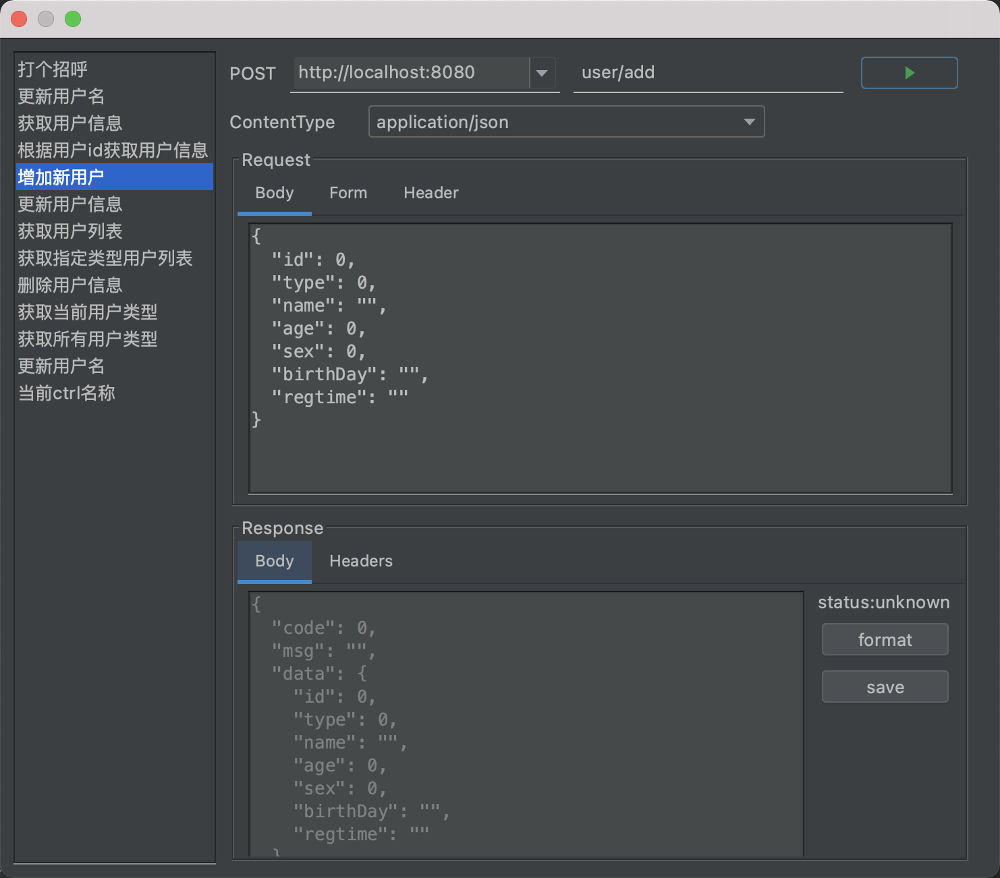

# Call (Postman-like Tool)

- Open the file in your project that contains the API, right-click on the file content, and select `Call Api` to make API requests through the window.
- You can configure your own shortcuts.
- Automatic login can be achieved through [relevant settings](/setting/rules/http_call_before.html).

---

**Call Related Rules**

| &nbsp;&nbsp;&nbsp;&nbsp;Key | Target (Context) | Version | Description |
| ------------ | ------------ | ------------ |------------ |
| &nbsp;&nbsp;&nbsp;&nbsp;[http.call.before](/setting/rules/http_call_before.html)  | request | v1.9.0+ | Callback before an HTTP request is made. |
| &nbsp;&nbsp;&nbsp;&nbsp;[http.call.after](/setting/rules/http_call_after.html)  | request&response | v1.9.0+ | Callback after an HTTP request is made.  |

Click [here](/setting/config-rule.html) to view more about rule configuration.
