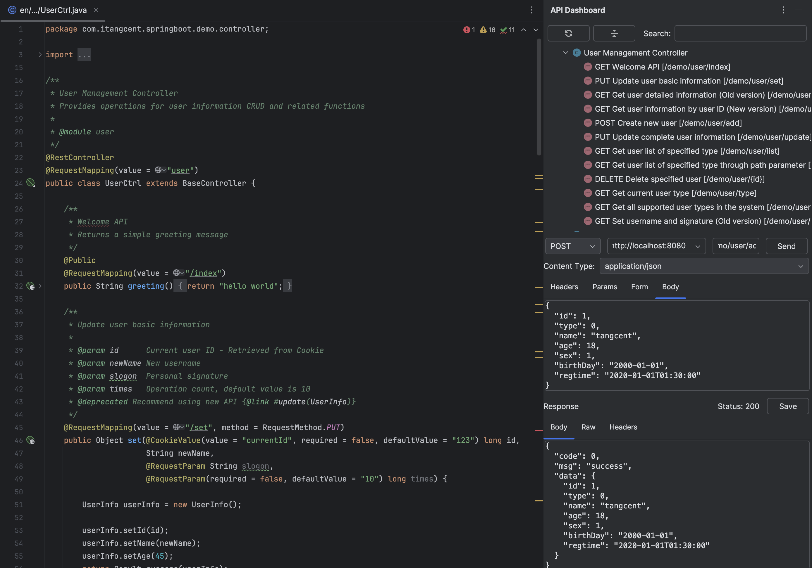

# Call API - Built-in API Debugging Tool

## Overview

Call API is a lightweight API debugging tool directly integrated into the IDE, allowing you to quickly test and debug APIs without switching to external applications. It provides a clean interface and convenient workflow, particularly suitable for daily API debugging needs during development.

- **Use Cases**: Quick API testing and debugging during daily development
- **Advantage**: No need to switch to external tools, complete debugging directly in the IDE
- **Positioning**: Designed for quick verification during development; for more complex testing scenarios, consider using the [Export to Postman](/documents/export2postman.html) feature

## How to Use

1. Open the file in your project that contains the API
2. Right-click on the file content, and select `Call Api`
3. Edit request parameters and send API requests through the window

## Key Features

- **Automatic Login**: Achieve through [http.call.before](/setting/rules/http_call_before.html) rule configuration
- **Response Processing**: Process response data using [http.call.after](/setting/rules/http_call_after.html) rule configuration
- **Seamless Integration**: Perfectly integrated with the IDE for a smooth development experience

## Usage Recommendations

- Suitable for scenarios requiring quick API response verification during development
- For scenarios requiring saved test cases, test collections, or complex test workflows, use the [API Export feature](/documents/export2postman.html)
- Combined with [rule configurations](/setting/config-rule.html), automated test processes and data processing can be achieved

---

## Call Related Rules

| Key | Target (Context) | Version | Description |
| ------------ | ------------ | ------------ |------------ |
| [http.call.before](/setting/rules/http_call_before.html) | request | v1.9.0+ | HTTP request pre-callback, can be used for automatic login, adding common headers, etc. |
| [http.call.after](/setting/rules/http_call_after.html) | request&response | v1.9.0+ | HTTP request post-callback, can be used for response data processing, logging, etc. |

Click [here](/setting/config-rule.html) to view more about rule configuration.
