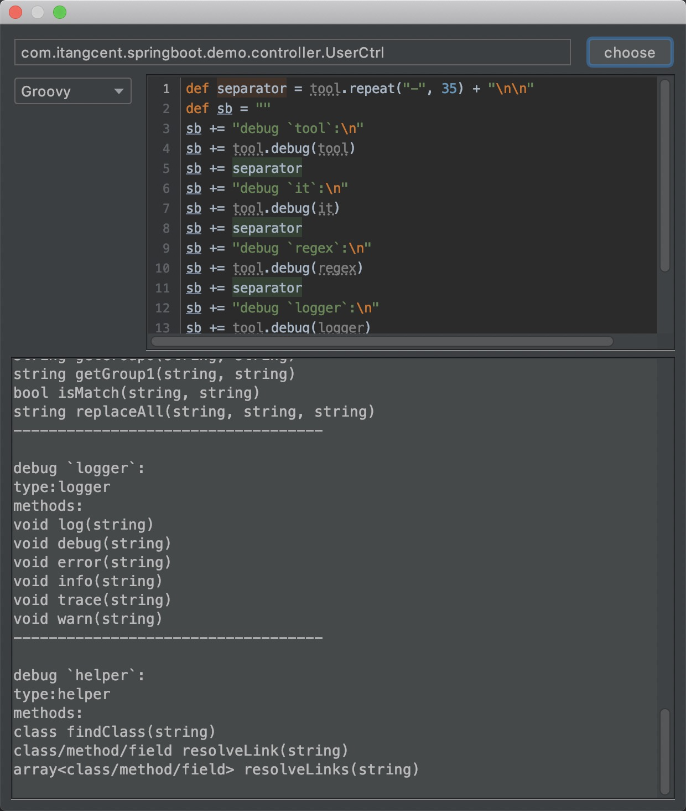

**Debug**

- Click <kbd>Code</kbd> > <kbd>Debug</kbd>, The script debug dialog will be open.
    


---

- Click`choose` to select debug target
- Select the debug script type on the left.The script types available depend on 'JDK' support:In general`Groovy`/`JavaScript`/`General`
- The script will execute automatically while stops typing '3s', and displays the results below.
- Tools/Context provided by the plug-in: [tools](/setting/tools.html)

---

By default, The selected context for the debug is 'class'.
If you need to debug other context, try reassign 'it' in the script header.

For example, to debugg 'method' as follows:

```groovy
//Switch Context, now 'it' is the first method in the class
it = it.methods()[0]

//Now you can try to write a script with 'method'
def separator = tool.repeat("-", 35) + "\n\n"
def sb = ""
sb += "debug `tool`:\n"
sb += tool.debug(tool)
sb += separator
sb += "debug `it`:\n"
sb += tool.debug(it)
```