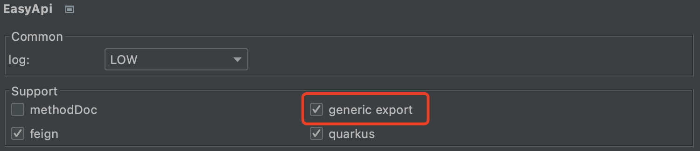

# Generic (Custom Framework)

The plugin can support custom web frameworks through configuration. Here are the steps:
- Enable `generic`



- Configure the [related settings](/setting/index.html) for `generic`

---

**Generic Related Rules**

| &nbsp;&nbsp;&nbsp;&nbsp;key | target(context) | version | desc |
| ------------ | ------------ | ------------ |------------ |
| &nbsp;&nbsp;&nbsp;&nbsp;[generic.class.has.api](/documents/generic.html)  | class | v2.2.1+ | Determine if a class has any API |
| &nbsp;&nbsp;&nbsp;&nbsp;[generic.path](/documents/generic.html)  | class/method | v2.2.1+ |  Get the HTTP path from a class/method |
| &nbsp;&nbsp;&nbsp;&nbsp;[generic.http.method](/documents/generic.html)  | class/method | v2.2.1+ | Get the HTTP method from a class/method |
| &nbsp;&nbsp;&nbsp;&nbsp;[generic.method.has.api](/documents/generic.html)  | class | v2.2.1+ | Determine if a method has an API  |
| &nbsp;&nbsp;&nbsp;&nbsp;[generic.param.name](/documents/generic.html)  | param | v2.2.1+ | Get the name of a parameter |
| &nbsp;&nbsp;&nbsp;&nbsp;[generic.param.as.json.body](/documents/generic.html)  | param | v2.2.1+ | Determine if a parameter should be treated as a JSON body |
| &nbsp;&nbsp;&nbsp;&nbsp;[generic.param.as.form.body](/documents/generic.html)  | param | v2.2.1+ | Determine if a parameter should be treated as a form |
| &nbsp;&nbsp;&nbsp;&nbsp;[generic.param.as.path.var](/documents/generic.html)  | param | v2.2.1+ | Determine if a parameter should be treated as a URL path variable |
| &nbsp;&nbsp;&nbsp;&nbsp;[generic.param.path.var](/documents/generic.html)  | param | v2.2.1+ | Get the name of a parameter as a URL path variable |
| &nbsp;&nbsp;&nbsp;&nbsp;[generic.param.as.cookie](/documents/generic.html)  | param | v2.2.1+ | Determine if a parameter should be treated as a Cookie |
| &nbsp;&nbsp;&nbsp;&nbsp;[generic.param.cookie](/documents/generic.html)  | param | v2.2.1+ | Get the name of a parameter as a Cookie  |
| &nbsp;&nbsp;&nbsp;&nbsp;[generic.param.cookie.value](/documents/generic.html)  | param | v2.2.1+ | Get the value of a parameter as a Cookie |
| &nbsp;&nbsp;&nbsp;&nbsp;[generic.param.header](/documents/generic.html)  | param | v2.2.1+ | Get the content of a parameter as a Header  |


---

The following is an equivalent `generic configuration` for the `spring framework`

``````
# generic.class.has.api
generic.class.has.api=@org.springframework.stereotype.Controller
generic.class.has.api=@org.springframework.web.bind.annotation.RestController

# generic.path
generic.path[@org.springframework.web.bind.annotation.RequestMapping]=@org.springframework.web.bind.annotation.RequestMapping#value
generic.path[@org.springframework.web.bind.annotation.RequestMapping]=@org.springframework.web.bind.annotation.RequestMapping#path
generic.path[@org.springframework.web.bind.annotation.GetMapping]=@org.springframework.web.bind.annotation.GetMapping#value
generic.path[@org.springframework.web.bind.annotation.GetMapping]=@org.springframework.web.bind.annotation.GetMapping#path
generic.path[@org.springframework.web.bind.annotation.PostMapping]=@org.springframework.web.bind.annotation.PostMapping#value
generic.path[@org.springframework.web.bind.annotation.PostMapping]=@org.springframework.web.bind.annotation.PostMapping#path
generic.path[@org.springframework.web.bind.annotation.PutMapping]=@org.springframework.web.bind.annotation.PutMapping#value
generic.path[@org.springframework.web.bind.annotation.PutMapping]=@org.springframework.web.bind.annotation.PutMapping#path
generic.path[@org.springframework.web.bind.annotation.DeleteMapping]=@org.springframework.web.bind.annotation.DeleteMapping#value
generic.path[@org.springframework.web.bind.annotation.DeleteMapping]=@org.springframework.web.bind.annotation.DeleteMapping#path
generic.path[@org.springframework.web.bind.annotation.PatchMapping]=@org.springframework.web.bind.annotation.PatchMapping#value
generic.path[@org.springframework.web.bind.annotation.PatchMapping]=@org.springframework.web.bind.annotation.PatchMapping#path

# generic.http.method
generic.http.method[@org.springframework.web.bind.annotation.RequestMapping]=@org.springframework.web.bind.annotation.RequestMapping#method
generic.http.method[@org.springframework.web.bind.annotation.GetMapping]=GET
generic.http.method[@org.springframework.web.bind.annotation.PostMapping]=POST
generic.http.method[@org.springframework.web.bind.annotation.PutMapping]=PUT
generic.http.method[@org.springframework.web.bind.annotation.DeleteMapping]=DELETE
generic.http.method[@org.springframework.web.bind.annotation.PatchMapping]=PATCH

# generic.method.has.api
generic.method.has.api=@org.springframework.web.bind.annotation.RequestMapping
generic.method.has.api=@org.springframework.web.bind.annotation.GetMapping
generic.method.has.api=@org.springframework.web.bind.annotation.PostMapping
generic.method.has.api=@org.springframework.web.bind.annotation.PutMapping
generic.method.has.api=@org.springframework.web.bind.annotation.DeleteMapping
generic.method.has.api=@org.springframework.web.bind.annotation.PatchMapping

# generic.param.as.json.body
generic.param.as.json.body=@org.springframework.web.bind.annotation.RequestBody

# generic.param.as.form.body
generic.param.as.form.body=@org.springframework.web.bind.annotation.ModelAttribute

# generic.param.as.path.var
generic.param.as.path.var=@org.springframework.web.bind.annotation.PathVariable

# generic.param.path.var
generic.param.path.var=@org.springframework.web.bind.annotation.PathVariable#value
generic.param.path.var=@org.springframework.web.bind.annotation.PathVariable#name

# generic.param.as.cookie
generic.param.as.cookie=@org.springframework.web.bind.annotation.CookieValue
# generic.param.cookie
generic.param.cookie=@org.springframework.web.bind.annotation.CookieValue#value
generic.param.cookie=@org.springframework.web.bind.annotation.CookieValue#name
# generic.param.cookie.value
generic.param.cookie=@org.springframework.web.bind.annotation.CookieValue#defaultValue

# generic.param.name
generic.param.name=@org.springframework.web.bind.annotation.RequestParam#value
generic.param.name=@org.springframework.web.bind.annotation.RequestParam#name

# generic.param.header
generic.param.header[@org.springframework.web.bind.annotation.RequestHeader]=groovy:```
def headerAnn = it.annMap("org.springframework.web.bind.annotation.RequestHeader")
def header = [:]
if(headerAnn.containsKey("name")){
    header["name"] = headerAnn["name"]
}
if(headerAnn.containsKey("value")){
    header["name"] = headerAnn["value"]
}
if(headerAnn.containsKey("defaultValue")){
    header["example"] = headerAnn["defaultValue"]
}
if(headerAnn.containsKey("required")){
    header["required"] = headerAnn["required"]
}
return tool.toJson(header)
```

# param.required
param.required=@org.springframework.web.bind.annotation.RequestParam#required
``````