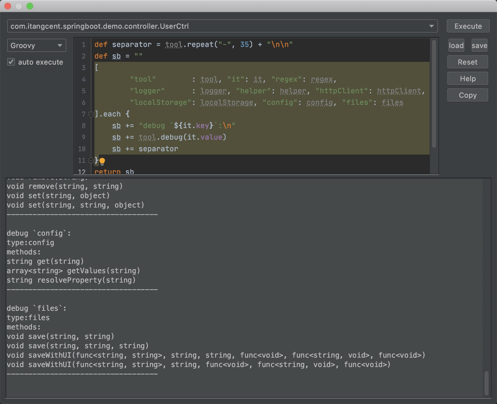

**Script Executor**

***Feature Introduction***

Script Executor is a script debugging tool that helps you more easily use the [rich configuration rules](/setting/config-rule.html) provided by this plugin.
When you need to configure complex rules but have difficulty writing scripts directly, Script Executor provides an interactive environment that allows you to:

- Test and debug complex rule configurations in real-time, seeing execution results immediately
- Try different script logic in a friendly interface without repeatedly modifying project configurations
- Learn and master available APIs and tool objects through examples
- Quickly validate whether your configuration ideas are feasible, improving development efficiency
- Identify potential issues before formal application, ensuring rules work as expected

***How to Use***

- Click on <kbd>Code</kbd> > <kbd>ScriptExecutor</kbd> at the top with the mouse to open the script execution interface.
    

***Writing and executing scripts***

- Click `choose` to select a context object.
- Select the debug script type on the left, the available types depend on the `JDK` support: usually `Groovy`/`JavaScript`/`General`.
- The script will be executed automatically about `3s` after you stop typing, and the results will be displayed below.
- Tools/objects provided by the plugin: [tools](/setting/tools.html)

***Other help buttons***

- Click `reset` to reset the script to the default help script.
- Click `help` to execute and output the default help script. 
- Click `copy` to copy the current script to the clipboard.